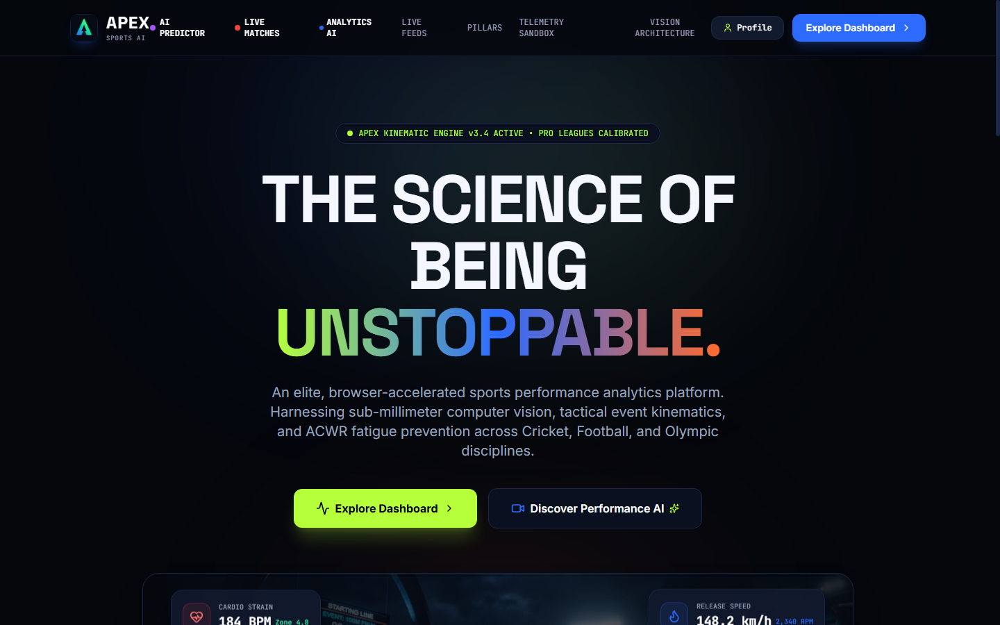
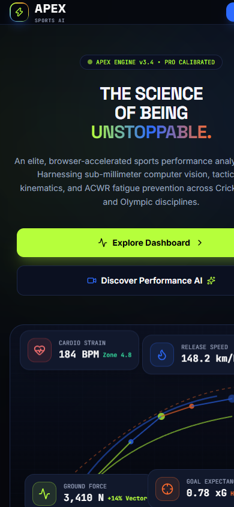

# APEX — High-Performance Sports Intelligence Platform

> **"The Science of Being Unstoppable."**  
> APEX is an elite, responsive AI-powered sports performance analytics platform engineered with design precision inspired by **Linear**, **Vercel**, **Apple Vision Pro**, and **Formula 1 telemetry**.

<div align="center">

[](https://evilswordboy-bot.github.io/apex-intelligence/)
[](https://github.com/evilswordboy-bot/apex-intelligence)
[](https://nextjs.org)
[](https://fastapi.tiangolo.com)
[](https://github.com/evilswordboy-bot/apex-intelligence)

### 🚀 [Experience Live Landing Page Online](https://evilswordboy-bot.github.io/apex-intelligence/)

<a href="https://evilswordboy-bot.github.io/apex-intelligence/">
  
</a>

<p align="center">
  <em>Desktop and Mobile Responsive Breakpoints</em>
</p>

<table>
  <tr>
    <td width="70%" valign="top">
      
    </td>
    <td width="30%" valign="top">
      
    </td>
  </tr>
</table>

</div>

---

## 🌟 Overview & Highlights

APEX provides a production-grade, extensible foundation for sports biomechanics and tactical analytics across **Cricket**, **Football**, and **Olympic Disciplines**:

- 🏎️ **F1-Grade Dark Spatial Design System**: Carbon-black canvas (`#05070D`), elevated glass surfaces (`#121A2E`), high-contrast typography (`#F5F7FF`), and sport-specific chromatic accents (`#B6FF3B` Electric Lime for Cricket, `#2D6BFF` Apex Cobalt for Football, `#FF6B2C` Solar Flame for Olympics).
- ⚡ **Cinematic Landing Page**: APEX wordmark with glowing titanium badge, oversized headline, dual functional CTAs, animated sports-stat ticker, floating biomechanical HUD elements, interactive Bento Grid, and a live client-side kinetic simulation sandbox ([Live Preview](https://evilswordboy-bot.github.io/apex-intelligence/)).
- 🏏 **Phase 2: Cricket Intelligence Lab**:
  - **FastAPI Microservice Backend**: Mounted at port `8000`, backed by SQLite schema (`backend/data/cricket_lab.db`) with Cricsheet ball-by-ball import pipeline.
  - **Calibrated Win-Probability Model**: Scikit-Learn Platt sigmoid scaled Logistic Regression model (Brier: `0.1339`, Log Loss: `0.4127`).
  - **Dynamic Chase Simulation**: Real-time Bayesian odds shift and explainable factor attributions.
  - **Interactive 360° Wagon Wheel**: Radial scoring ground with recorded vs illustrative shot labeling.
  - **Batter vs Bowler Head-to-Head Matrix**: Matchup strike rates, boundary frequencies, dot-ball %, dismissals, and sample sufficiency classification.
  - **Innings Phase Decomposition**: Powerplay (1-6), Middle (7-15), and Death (16-20) analytics.
  - **AI Bowler Recommendation**: 20-over tactical captaincy advisor ranking bowlers by phase and matchup history.
  - **Player Radar Benchmark**: Multi-axis radar comparing elite athletes.
- 🤖 **Phase 3: AI Sports Intelligence Agent**:
  - **Dedicated Agent Workspace**: Dedicated route at `/agent` and integrated tab in `/dashboard?tab=analyst`.
  - **Transparent Tool Calling**: Visual execution progress states (`Thinking` → `Selecting tool` → `Retrieving data` → `Analysing` → `Response ready`).
  - **RAG Knowledge Corpus & Citations**: Multi-document knowledge retrieval with verified citations and source metadata chips.
  - **Structured Result Cards**: In-chat interactive cards for match scorecards, head-to-head metrics, win-probability gauges, and AI bowler recommendations.
  - **Dual Model Engine**: Configurable Google Gemini REST engine (`GEMINI_API_KEY`) with transparent local heuristic intelligence fallback.
- 🎨 **Phase 4: Brand Identity & AI Visual Assets**:
  - **Geometric APEX Vector Mark**: Kinetic upward chevron peak vector logo (`public/branding/apex-logo.svg`) and matching favicon (`public/branding/favicon.svg`).
  - **AI-Generated High-Resolution Imagery**: Realistic sports visuals organized in `public/images/{hero, cricket, football, olympics, abstract}`.
  - **Reusable ApexImage Component**: Gradient contrast overlays, telemetry badges, and graceful fallback handling.
- 📊 **Phase 5: Advanced Sports Intelligence & Analytics**:
  - High-impact KPIs, 6-axis biomechanics radar, deterministic AI insights, and CSV telemetry exports (`/analytics`).
- 🔴 **Phase 6: Live Sports API Integration**:
  - Real-time match centre, polling relay, live score cards, event timeline, head-to-head records, and league standings (`/live`).
- 🔮 **Phase 7: AI Sports Prediction Engine**:
  - Calibrated logistic regression ML win forecasting, Brier/LogLoss metrics, feature importance attribution, and simulation (`/predictions`).
- 👤 **Phase 8: User Accounts & Personalization**:
  - **Cryptographic Security**: Salted PBKDF2-HMAC-SHA256 password hashing (100,000 rounds) + HS256 JWT tokens.
  - **Server-Derived Identity**: Strict token validation; user resources never rely on client-supplied IDs.
  - **User Profile Management**: Display name, bio, regional timezones, odds format (`probability`, `decimal`, `american`), and units (`metric`, `imperial`).
  - **Personalized Dashboards**: Persistent squad/athlete favorites, reorderable widgets, and custom views (`/profile` and `/dashboard?tab=profile`).
  - **Privacy & Security**: Automated password recovery flow and GDPR-compliant cascading account wipe.
- ⚽ **Football Lab & 🏃 Olympic Lab**: xG spatial maps, passing networks, sprint acceleration, and kinetic force curves.
- ⌨️ **Keyboard Accessibility & Commands**: Full `Ctrl+K` / `Cmd+K` command palette, focus rings, and reduced-motion compliance.
- 🔒 **Zero External API Keys Required**: 100% functional locally out of the box with automated fallback mechanisms.

---

## 🛠️ Technology Stack

- **Frontend**: Next.js 14 (App Router), TypeScript 5, Tailwind CSS 3.4, Framer Motion, Recharts, Lucide React
- **Backend**: FastAPI, Python 3.13, Pydantic v2, SQLite, HTTPX
- **Machine Learning**: Scikit-learn (Calibrated Logistic Regression with Platt Sigmoid Scaling)
- **AI & RAG Engine**: Multi-document RAG retrieval index + Gemini REST client / Local Heuristic Engine
- **Data Engineering**: Cricsheet JSON parser pipeline (`backend/data/scripts/cricsheet_importer.py`)
- **Visuals & Branding**: Custom geometric SVG branding + AI-generated sports imagery

---

## 🚀 Quickstart & Setup Instructions

### 1. Prerequisites
- Node.js `v18+` or `v20+`
- Python `3.10+` (tested on Python 3.13)

### 2. Environment Variables (Optional)
APEX operates out of the box in **Local Deterministic Intelligence Mode**. To enable Google Gemini REST integration, create a `.env` file in the `backend/` directory:
```env
GEMINI_API_KEY="your-gemini-api-key"
```

### 3. Backend Setup & Startup
Navigate to the backend directory:
```bash
cd backend
```

Seed the database and train the win-probability model:
```bash
python -m data.scripts.seed_db
python -m ml.train_win_prob
```

Run the Phase 5 automated test suite (7 tests):
```bash
python test_phase5_analytics.py
```

Run pytest unit tests (24 tests):
```bash
python -m pytest tests/
```

Start the FastAPI backend server:
```bash
python -m uvicorn app.main:app --port 8000 --host 127.0.0.1
```

### 4. Frontend Setup & Startup
In a separate terminal, navigate to the project root:
```bash
npm install
npm run build
npm start
```

- Open **[http://localhost:3000/analytics](http://localhost:3000/analytics)** to access the Phase 5 Sports Intelligence console.
- Open **[http://localhost:3000/dashboard?tab=analytics](http://localhost:3000/dashboard?tab=analytics)** to view Analytics embedded within the dashboard.
- Open **[http://localhost:3000/agent](http://localhost:3000/agent)** to access the AI Sports Agent workspace.
- Open **[http://localhost:3000/dashboard?tab=cricket](http://localhost:3000/dashboard?tab=cricket)** to view the live Cricket Intelligence Lab.

---

## 📁 Project Architecture

```
apex-intelligence/
├── backend/
│   ├── app/
│   │   ├── main.py                  # FastAPI application with CORS & health check
│   │   ├── database.py              # SQLite schema, connections & indexes
│   │   ├── models/                  # Pydantic v2 schemas (cricket, agent, analytics)
│   │   ├── routers/                 # Endpoints (/api/cricket, /api/agent, /api/v1/analytics)
│   │   └── services/                # Business logic, ML models, and agent RAG tools
│   ├── data/
│   │   ├── cricket_lab.db           # SQLite database
│   │   └── scripts/                 # Seeding & Cricsheet import scripts
│   ├── ml/
│   │   ├── train_win_prob.py        # Calibrated logistic regression training script
│   │   └── models/                  # Serialized .joblib model & metadata
│   ├── tests/                       # Pytest test suite (24 tests)
│   └── test_phase5_analytics.py     # Automated Phase 5 integration test suite
├── public/
│   ├── branding/                    # Geometric APEX SVG logo and favicon
│   └── images/                      # AI-generated sports imagery ({hero, cricket, football, olympics, abstract})
├── src/
│   ├── app/
│   │   ├── analytics/page.tsx       # Dedicated Phase 5 Sports Intelligence page
│   │   ├── agent/page.tsx           # Dedicated standalone AI Agent page
│   │   ├── dashboard/page.tsx       # Analytics dashboard with embedded modules
│   │   ├── layout.tsx               # Root layout with SVG favicon metadata
│   │   ├── globals.css              # Design system variables
│   │   └── page.tsx                 # Cinematic landing page
│   ├── components/
│   │   ├── SportsIntelligenceAnalytics.tsx # Phase 5 Interactive Analytics & AI Insights
│   │   ├── AIAgentWorkspace.tsx     # Interactive AI Sports Agent workspace
│   │   ├── CricketLab.tsx           # Phase 2 Cricket Intelligence Lab
│   │   ├── FootballLab.tsx          # Football analytics
│   │   ├── OlympicLab.tsx           # Olympic biomechanics
│   │   ├── AthleteComparison.tsx    # Head-to-head comparison
│   │   └── ApexImage.tsx            # High-contrast sports image component
│   ├── lib/
│   │   ├── liveApi.ts               # Phase 6 Live Sports API client
│   │   ├── analyticsApi.ts          # Phase 5 Analytics API client & CSV exporter
│   │   ├── agentApi.ts              # Agent API caller functions
│   │   └── cricketApi.ts            # Cricket API caller functions
│   └── types/
│       ├── live.ts                  # Phase 6 Live match, standings, telemetry types
│       ├── analytics.ts             # Phase 5 TypeScript definitions
│       ├── agent.ts                 # Agent interfaces
│       └── cricket.ts               # Cricket interfaces
├── next.config.mjs                  # Next.js config with API proxy rewrites
└── README.md                        # Project documentation
```

---

## ⚡ Phase 6: Live Sports API Integration

APEX transforms into a live sports match centre with real-time fixture tracking, chase telemetry, and league standings.

### Key Features
1. **Live Match Centre (`/live` & Dashboard Tab)**:
   - Dedicated full-page route at `/live` and an embedded tab inside `/dashboard?tab=live`.
   - Real-time scoreboards for Cricket (IPL, ICC World Championship) and Football (Champions League, Premier League).
   - Win probability chase meters dynamically rendered for live fixtures.
   - Match detail dialog modal featuring ball-by-ball timeline events, verified player lineups, and live telemetry sensors.
   - Official competition tables (IPL points table with NRR, Premier League standings with GD and 5-match form pills).
2. **Multi-Provider Architecture & Transparent Data Truthfulness**:
   - Primary: TheSportsDB connector with API key support via `SPORTS_API_KEY` environment variable.
   - Resilient Fallback: Calibrated local relay engine guaranteeing instant zero-configuration local execution with realistic sports data.
   - Provider Status Bar: Live status indicator displays provider name, latency (ms), remaining rate quota, and truth badges: `LIVE EXTERNAL FEED` vs `CALIBRATED LOCAL RELAY (DEMO)`.
3. **Resilient High-Frequency Polling**:
   - 15-second automatic polling cycle with toggle switch (`Auto-Poll`) and manual instant refresh button.
   - Guaranteed timer teardown (`clearInterval`) on component unmount preventing memory leaks.
   - In-memory server-side TTL caching (15 seconds for live matches, 60 seconds for standings) to prevent provider rate-limit exhaustion.

### Phase 6 API Endpoints
- `GET /api/v1/live/matches?sport=cricket|football|all&status=live|upcoming|completed`: List fixtures with scores and win probabilities.
- `GET /api/v1/live/matches/{match_id}`: Match breakdown with telemetry sensors, lineups, and timeline events.
- `GET /api/v1/live/standings?sport=cricket|football&league=...`: Official competition ladder.
- `GET /api/v1/live/providers/status`: Health check, active provider, latency, and live/demo classification.

---

## 🧠 Phase 7: AI Sports Prediction Engine

APEX introduces a machine-learning forecasting engine estimating sports outcomes and expected scores using historical statistics, rolling team form, and venue factors under strict time-aware validation.

### Key Capabilities
1. **Interactive Predictions Lab (`/predictions` & Dashboard Tab)**:
   - Dedicated full-page route at `/predictions` and embedded tab inside `/dashboard?tab=predictions`.
   - Upcoming match selector with calibrated outcome probabilities (Cricket 2-way split, Football 3-way split supporting draws).
   - Expected scoring regression: T20 first-innings score range (e.g. 174–194 runs) and Football projected scorelines (e.g. 2.1–1.2 xG).
   - Explainable Factor Attribution chips (+/- impact %): Home edge, rolling form differential, and head-to-head records.
   - **Tactical Scenario Sandbox**: Interactive controls allowing scouts to tweak squad availability (50%–100%), venue, and toss decisions to observe real-time model re-calibration.
   - **Model Transparency & Calibration Deck**: Live benchmark comparisons against naive baseline priors (Log Loss, Brier Score, Accuracy, Expected Calibration Error).
   - **Prediction Audit History**: Historical record of past predictions verified against confirmed final match scores with Brier error scores.
2. **Machine-Learning Pipeline (`backend/ml/train_prediction_engine.py`)**:
   - **Data Validation & Preprocessing**: Chronologically ordered match histories from 2021 to 2025 across IPL and Premier League.
   - **Time-Aware Temporal Split**: Seasons 2021–2024 for training, Season 2025 for validation to strictly eliminate future-data leakage.
   - **Probability Calibration**: `CalibratedClassifierCV` using Platt Sigmoid scaling, ensuring predicted probabilities match empirical observation frequencies.
   - **Data Sufficiency Guardrail**: Explicitly flags low-sample or unknown matchups (`insufficient_data`) rather than fabricating uncalibrated percentages.
   - **Reproducible Model Artifacts**: Version `7.0.0` serialized to `backend/ml/models/` (`cricket_match_predictor.joblib`, `football_match_predictor.joblib`, `prediction_models_metadata.json`).
3. **Phase 7 API Endpoints (`/api/v1/predictions/*`)**:
   - `GET /api/v1/predictions/upcoming?sport=all|cricket|football`: List upcoming fixtures with calibrated outcome probabilities and expected scores.
   - `POST /api/v1/predictions/match`: Custom matchup simulation with squad availability and venue modifiers.
   - `GET /api/v1/predictions/metrics`: Comprehensive benchmark metrics comparing baseline models to calibrated classifiers.
   - `GET /api/v1/predictions/history`: Historical predictions audit trail with actual outcomes.
   - `POST /api/v1/predictions/retrain`: Pipeline execution trigger for reproducible model re-calibration.

---

## 👤 Phase 8: User Accounts & Personalization

APEX introduces enterprise-grade user authentication, cryptographically secure account sessions, and user personalization engines.

### Key Capabilities
1. **Authentication & Session Security**:
   - Salted PBKDF2-HMAC-SHA256 password hashing (100,000 rounds) with cryptographically unique salts.
   - HS256 JWT access tokens with 7-day expiration and automatic signature verification.
   - Server-derived identity enforcement — API routes strictly extract user IDs from verified tokens.
   - Password recovery simulation (`POST /api/v1/auth/forgot-password` and `reset-password`).
   - Cascading account deletion (`DELETE /api/v1/auth/account`) ensuring GDPR right-to-be-forgotten compliance.
2. **Personalization Hub (`/profile` & Dashboard Tab)**:
   - Profile attributes: display name, bio, regional timezones, odds representation (`probability`, `decimal`, `american`), measurement units (`metric`, `imperial`).
   - Favorite team and athlete bookmarking with one-click toggles across live match and prediction views.
   - Persistent personalized dashboard views saved directly to SQLite database.

---

## 🚀 Phase 9: Final Integration, Testing & Production Audit

Unified integration audit across all modules ensuring seamless interconnectivity, zero console errors, zero dead links, and automated CI/CD readiness.

### Highlights
- Comprehensive test coverage across all endpoints (`backend/test_phase9_integration.py`).
- Next.js production compilation with zero build errors and optimized route tree.
- Synchronized command palette (`Ctrl+K`), global navigation headers, and responsive footers.

---

## 🌐 Phase 10: Public Launch, Monitoring & Growth

APEX Phase 10 equips the platform for enterprise hosting, operational observability, privacy governance, and active community feedback loops.

### Key Capabilities
1. **Public Deployment Readiness & Hardening**:
   - Production security headers middleware injecting `X-Content-Type-Options: nosniff`, `X-Frame-Options: DENY`, `X-XSS-Protection: 1; mode=block`, `Strict-Transport-Security`, `Referrer-Policy: strict-origin-when-cross-origin`, and `Permissions-Policy`.
   - Standardized `.env.example` templates for decoupled frontend and backend deployments.
   - CORS credentials protection restricted to approved production origins.
2. **Operational Monitoring & System Diagnostics (`GET /api/v1/platform/diagnostics`)**:
   - Real-time telemetry: process memory RSS (MB), server uptime (seconds), active ML model registry, and database table row counters.
   - Live health status cards embedded in the User Feedback Hub and admin triage dashboards.
3. **Privacy-Conscious Product Analytics (`/api/v1/platform/events/*`)**:
   - Zero-PII event tracking logging user interactions (page views, model runs, exports) with ephemeral session IDs.
   - Aggregate summary endpoint providing session and event category distribution without third-party ad trackers.
4. **User Feedback & Roadmap Hub (`/feedback` & Dashboard Tab)**:
   - Multi-category submission modal (suggestions, bugs, feature requests) with anti-spam rate limiting and input length constraints.
   - Community roadmap and feedback status board (`pending`, `reviewed`, `resolved`).
   - Administrative triage deck for engineering review and resolution notes.
5. **Legal & Compliance Transparency (`/privacy` & `/terms`)**:
   - Dedicated Privacy Policy route detailing on-device computer vision processing and zero-telemetry selling commitments.
   - Dedicated Terms of Service & Model Disclaimers route providing sports analytics probabilistic guidelines, responsible wagering warnings, and synthetic demo data labeling.

---

## 🧪 Verification & Responsive Breakpoints

Verified across three standard viewports:
1. **Mobile (390px × 844px)**: Responsive controls, touch-friendly tab pills, single-column KPI cards, wrapped header with APEX branding.
2. **Tablet (768px × 1024px)**: 2-column responsive layout, full-bleed charts, optimized radar visual.
3. **Desktop (1440px × 900px)**: Multi-column bento analytics, side-by-side radar overlay, AI telemetry diagnostics, live activity stream.

---

## 📜 License
Private & Confidential — APEX Sports Technologies 2026.
